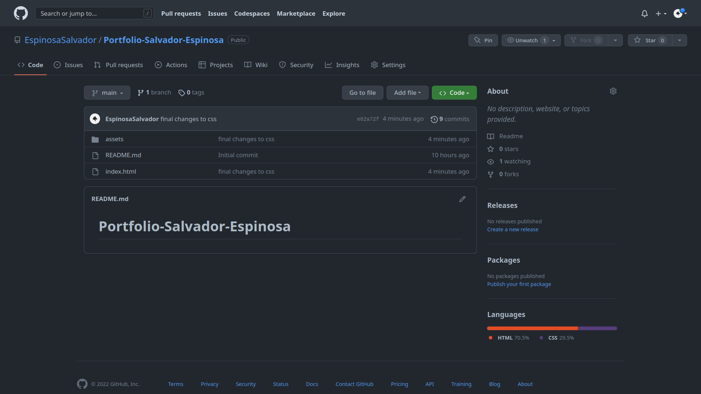
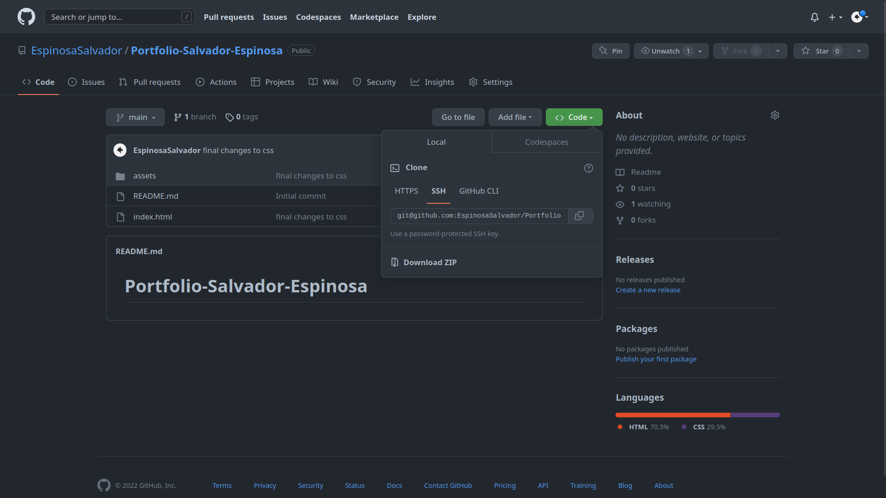

# Portfolio-Salvador-Espinosa

## Table of Content

* [Introduction](#introduction)
* [Features](#features)
* [Requirements](#requirements)
* [Installation](#installation)
* [Configuration](#configuration)
* [Troubleshooting](#troubleshooting)
* [FAQ (Frecuently Asked Questions)](#faq-frecuentrly-asked-questions)
* [Team](#team)

## Introduction

This is my portfolio the version 1, this was requested by the Tec-Bootcamp but nontheless will be future updated and will be evolving throught time.

## Features

This are the following feautures of the Portfolio

links on the Navbar work and can send you to the correct place in the Webpage.

most of the dimensions in this code are in Rem due that it is easier to see the same product on different devices for example phones and tablets.

in Portfolio when we hover the mouse in the img. the images will increase and will ocupy more space but only when they are hovered.


## Requirements

the requirements to run this webpage are really low due that we are only using *HTML* and *CSS*.

* Vs code
* GitHub
* Internet

## Installation

To install this project please proceed to my [GitHub Repository](https://github.com/EspinosaSalvador/Portfolio-Salvador-Espinosa)

you should be able to see this,

 

Click on code as shown in the image



Copy the SSH key or the HTTPS key and open.

* Terminal
* Git bash
* CMD

either one of this will work. please proceed to the terminal an put in your Terminal,

```
git clone git@github.com:EspinosaSalvador/Portfolio-Salvador-Espinosa.git
```

and now you have a copy of the code.

## Configuration

If you want to do any configurations on this project please open a new branch you can do this by putting the following code in your terminal,

```
git checkout -b ＜new-branch＞
```

switch branches putting the following code on your terminal.

```
git checkout ＜branchname＞
```

If you want to show us your code and merge please open a pull request on [Github](https://github.com/EspinosaSalvador/Portfolio-Salvador-Espinosa/pulls).

## Troubleshooting

The webpage is a version 1.0 ,please let me know if there are anybug in the webpage by issuing it in [Github](https://github.com/EspinosaSalvador/Portfolio-Salvador-Espinosa/issues)

## FAQ (Frecuentrly Asked Questions)

We will update this part when we have some frequently asked question.

## Team

* Salvador Espinosa Valdez

at this moment 5/12/2022 I am the only one working on this project
